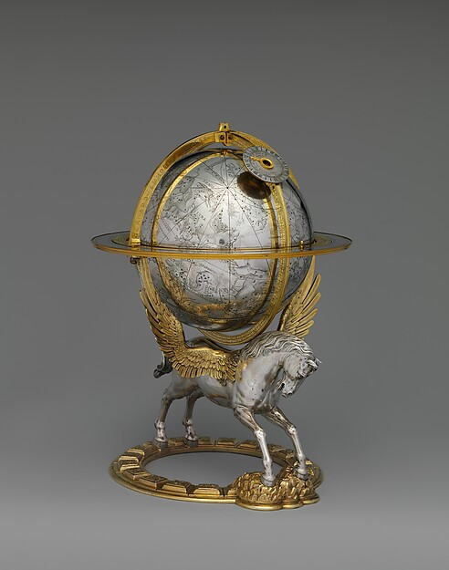

<p align="center">
  
</p>

<p align="center"><sub><em>Celestial globe with clockwork</em>, Gerhard Emmoser, 1579. The Met Open Access / Public Domain, via Cosmos Public Work.</sub></p>

# I BUILD STRANGE MACHINES FOR NO GOOD REASON.

```text
no roadmap.
no throne.
no algorithm to please.

just curiosity,
a terminal,
and the next weird system calling from the dark.
```

`Python / JavaScript / TypeScript / Rust / markets / agents / unfinished maps`

### trails

[pythonpine](https://github.com/kshlgrg/pythonpine) - technical indicators and trading logic  
[finda](https://github.com/kshlgrg/finda) - financial data pipes  
[bigtest](https://github.com/kshlgrg/bigtest) - backtesting and strategy experiments
