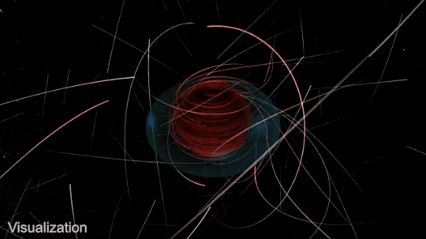

<p align="center">
  
</p>

<p align="center"><sub>dark matter circling the event horizon. NASA Goddard Scientific Visualization Studio. chosen because a quarter-life crisis deserves decent lighting.</sub></p>

```text
+------------------------------ KSHLGRG / FIELD DOC ------------------------------+
| status     : alive, technically                                                  |
| mood       : quarter-life crisis with a compiler                                  |
| thesis     : curiosity is just anxiety with better documentation                  |
| warning    : contains football takes, math flex, dark humor, and unshipped ideas  |
+---------------------------------------------------------------------------------+
```

# strange machines, no warranty.

> i code like a wanderer checking locked doors in an abandoned observatory.  
> sometimes the door opens. sometimes it asks for OAuth.

## 00 / operating notes

| key | value |
|---|---|
| `mode` | curiosity over certainty |
| `terrain` | markets, agents, data pipes, old maps, cursed interfaces |
| `languages` | Python / JavaScript / TypeScript / Rust |
| `football` | great ball knowledge, unfortunately not yet monetized |
| `life` | quarter-life crisis, but make it reproducible |

## 01 / little math flex

```txt
if chaos has structure, i want the eigenvectors.
if the model is wrong, i still want the residuals.
if xG says we cooked, i am spiritually unavailable for dissent.
```

## 02 / trails

| route | artifact | field note |
|---|---|---|
| `indicators` | [pythonpine](https://github.com/kshlgrg/pythonpine) | Pine-style technical analysis in Python. |
| `data` | [finda](https://github.com/kshlgrg/finda) | Financial data pipes with cache, fallback, and streams. |
| `tests` | [bigtest](https://github.com/kshlgrg/bigtest) | Backtesting engines for dangerous little hypotheses. |

<details>
<summary><strong>03 / dark humor config</strong></summary>

```txt
hope              = deprecated
panic             = default
sleep             = optional dependency
imposter_syndrome = installed globally
production        = where confidence goes to become a postmortem
```

</details>

<details>
<summary><strong>04 / scout report</strong></summary>

```txt
first touch       : clean enough
vision            : sees the pass before the exception
press resistance  : varies with caffeine
finishing         : xG merchant allegations denied
```

</details>
