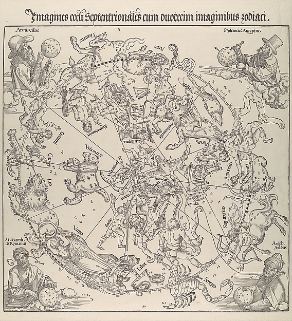

<p align="center">
  
</p>

<p align="center"><sub><em>The Celestial Map - Northern Hemisphere</em>, Albrecht Durer, 1515. The Met Open Access / Public Domain, found through the Cosmos Public Work lane.</sub></p>

```text
                 *
            .         .        FIELD MANUAL / KSHLGRG
       *        \   |   /      edition: curiosity-first
                 \  |  /
   ------- strange machines, built for no good reason -------
                 /  |  \
       .        /   |   \        no roadmap. no throne.
            *         .          just signal, static, and questions.
```

# KSHLGRG

> savage little wanderer in the machinery.  
> writing code because the unknown keeps leaving doors unlocked.

## 00 / operating notes

```txt
mode        : curiosity over certainty
terrain     : markets, agents, data pipes, old maps, weird interfaces
languages   : Python / JavaScript / TypeScript / Rust
constraint  : keep moving until the system talks back
```

## 01 / trails

| route | artifact | why it exists |
|---|---|---|
| `indicators` | [pythonpine](https://github.com/kshlgrg/pythonpine) | Pine-style technical analysis in Python. |
| `data` | [finda](https://github.com/kshlgrg/finda) | Financial data pipes with cache, fallback, and streams. |
| `tests` | [bigtest](https://github.com/kshlgrg/bigtest) | Backtesting engines for dangerous little hypotheses. |

<details>
<summary><strong>02 / field doctrine</strong></summary>

```txt
do not polish the compass until you have crossed the desert.
do not worship the stack.
do not wait for permission from the map.

build the probe.
throw it into the dark.
read what comes back.
```

</details>

<details>
<summary><strong>03 / current weather</strong></summary>

```txt
learning      : systems that trade, search, remember, and explain themselves
collecting    : public-domain diagrams, machines, celestial charts, broken UI rituals
avoiding      : performative productivity, beige portfolios, badges as personality
```

</details>
